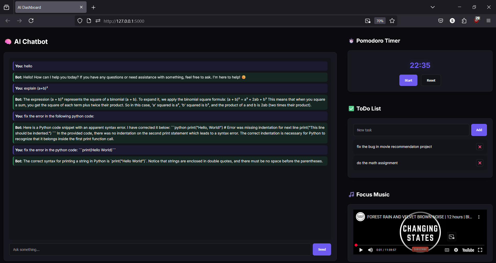

# 🧠 Local AI Dashboard with Chatbot + Productivity Tools

This is a fully offline, customizable AI dashboard powered by [Ollama](https://ollama.com/) and a Flask frontend.  
It features a local LLM chatbot (e.g., Mistral), a ToDo list, Pomodoro timer, and Spotify embed — accessible via desktop or mobile on your Wi-Fi network.

---

## 🚀 Features

- 🤖 Chatbot powered by local Ollama models (e.g., Mistral, DeepSeek)
- ✅ ToDo List (with add/remove)
- ⏱️ Pomodoro Timer (25-minute focus sessions)
- 🎵 Spotify embed
- 🖥️ Modern UI with Flask, HTML, CSS, and Inter font
- 📱 Mobile-friendly via local IP access

---
## Screenshot


## 🧠 Tech Stack

- Python + Flask
- HTML/CSS + JavaScript
- Ollama (LLM backend)
- Works on any local device (no internet required)

---

## 🛠 How to Run Locally

1. **Install Python packages**  
```bash
pip install flask requests
```

2. **Start Ollama in one terminal**  
```bash
ollama run mistral
```

3. **Start Flask server in another terminal**  
Modify `app.py`:
```python
app.run(host="0.0.0.0", port=5000)
```
Then run:
```bash
python app.py
```

4. **Find your local IP address**

- **Windows**:  
```bash
ipconfig
```

- **macOS/Linux**:  
```bash
ifconfig
```

Find the `IPv4 Address`, e.g., `192.168.1.42`

5. **On your mobile device** (same Wi-Fi), open:  
```
http://192.168.1.42:5000
```

---

## 📁 Project Structure

```
ollama-dashboard/
├── app.py
├── templates/
│   └── index.html
├── static/
│   ├── style.css
│   └── script.js
└── requirements.txt
```
Note: The User Interface is AI -generated, so it might not be perfect. You can customize it as you like.
---
---

## 🧾 License

MIT — Feel free to use, modify, and build upon this.

---

## ✍️ Author

**Shrijith S Menon**  
🔗 [shrijithsm.tech](https://shrijithsm.tech)
